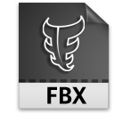

# Viewer for Virtual Reality


There are two viewers using **three.js**:

1. **vr-fbx-loader** for FBX (Filmbox) that is a proprietary file format (.fbx) developed by Kaydara and owned by Autodesk since 2006.
2. **vr-360-video** for 360 stereographic videos




## Prerequires

1. Git 2.6+
2. npm
3. npm http-server
3. ngrok


## How to Play

Clone

```
git clone https://github.com/humbertodias/vr-viewer-prototypes.git
```

Inside the folder

```
cd vr-viewer-prototypes/src
```

Run

```
npm install http-server -g
http-server -p 9999
```
```
Starting up http-server, serving ./
Available on:
  http://127.0.0.1:9999
  http://192.168.0.102:9999
Hit CTRL-C to stop the server
```

After it, on 

**Desktop** 

```
http://localhost:9999
```

Enabling public address

```
ngrok http 9999
```

```
grok by @inconshreveable                                       (Ctrl+C to quit)
                                                                                
Tunnel Status                 online                                            
Version                       2.0.25/2.1.1                                      
Region                        United States (us)                                
Web Interface                 http://127.0.0.1:4040                             
Forwarding                    http://75064ec0.ngrok.io -> localhost:9999        
Forwarding                    https://75064ec0.ngrok.io -> localhost:9999       
                                                                                
Connections                   ttl     opn     rt1     rt5     p50     p90       
                              0       0       0.00    0.00    0.00    0.00
```

Finally, access on your phone.
Using the address given above 
**Forwarding http://75064ec0.ngrok.io -> localhost:9999**

**Mobile**

```
http://75064ec0.ngrok.io
```


## Output


## References

1. three.js
	
	[http://threejs.org/](http://threejs.org/)

2. ngrok

	[https://ngrok.com/](https://ngrok.com/)

3. FBX format

	[https://en.wikipedia.org/wiki/FBX](https://en.wikipedia.org/wiki/FBX)