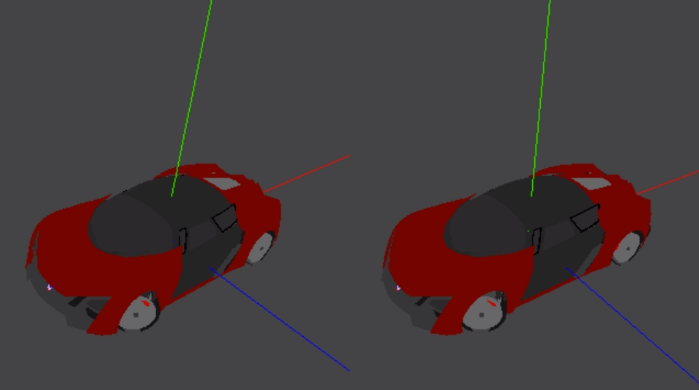
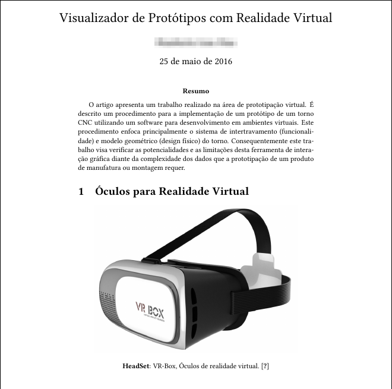

# Viewer for Virtual Reality


We create VR viewer using **three.js** supporting **assimp2json** json format.

## Available

[Play Store](https://play.google.com/store/apps/details?id=br.vr.viewer.models)

[YouTube](https://youtu.be/2gPtW7dqXWA)

## Prerequires

1. Git 2.6+
2. Cordova
3. make

## How to Play

Clone

```
git clone https://github.com/humbertodias/vr-viewer-prototypes.git
```

Inside the folder

```
cd vr-viewer-prototypes
```

Run

```
./build.sh
```

After it, checkout on 

```
src/platforms/**
```


## Output




## Documentation



[paper.pdf](doc/article/output.png)


## References

1. three.js
	
	[http://threejs.org/](http://threejs.org/)

2. hammer.js

	[http://hammerjs.github.io/](http://hammerjs.github.io/)
	
3. dat-gui

	[https://code.google.com/archive/p/dat-gui](https://code.google.com/archive/p/dat-gui)
	
4. Cordova

	[https://cordova.apache.org/](https://cordova.apache.org/)