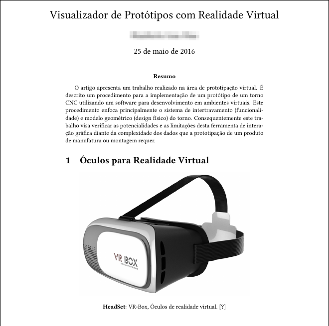

# Latex Paper

Review paper using BibTeX

## Prerequires

1. Latex 3.1+
2. Bibtex 0.9+
3. make 3.8+

## How to use

Inside the folder

```
cd doc
```

Run

```
make
```


## Output


[Paper PDF](paper.pdf)

## References

[Latex](https://www.latex-project.org/)

[BibTeX](http://www.bibtex.org/)

[Make](https://www.gnu.org/software/make/)

